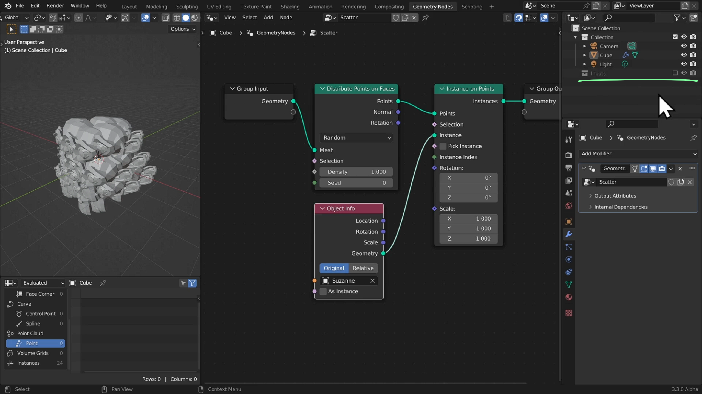

# DEV-02, A First Scatter
### Link:[<https://www.canopy.games/courses/bcs-geometry-nodes-3x/lectures/42544224>]
#### Tags: [Distribute Points on Faces, Instance on Points, Random Value, Join Geometry]

## Scatter an Object

    In order to scatter an object you need two things:
         The positions that we are going to scatter these things on
         The literal thing, the object to scatter

### Points | Distribute Points on Faces 

    In order for to generate points, random points on a surface is with a node called
    Distribute Points on Faces

### Instancing | Instance on Points

    The next thing that we want to do is make objects exist on those points.

    Make the original object hidden from viewport and render

    Better yet, make a new collection of your inputs and then make hidden

## Managing Random Rotation and Scale

### Rotation | Random Value (Vector) 

    The rotation is not intense enough from whats seen here. Rotation is measured in radians, where 2 * pi or tau is considered one rotation.
    1 across the board as the max as seen here is only a fraction of that.

    Use 2 * pi

    Or Use tau

    Both result into the same thing

### Scale | Random Value (Float) 

    We want the scale to be consistent across x y and z. A vector random would make these all randomize which is not what we want.
    SO we will use a float random to keep x y and z consistent with each other.

## Combining everything

### Combining | Join Geometry

