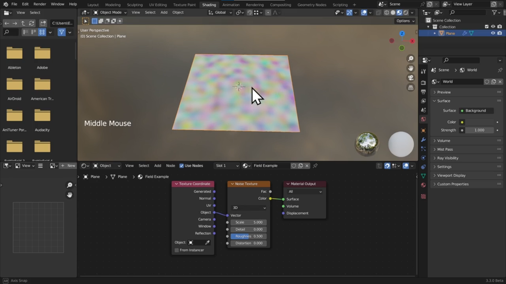
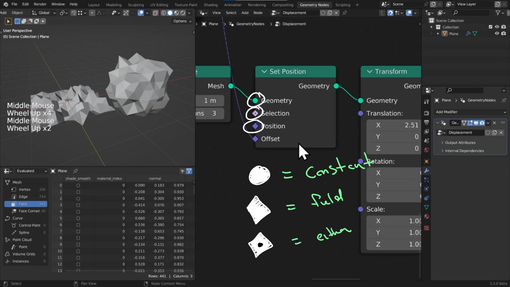

# DEV-04, How Does Geometry Nodes work
### Link:[<https://www.canopy.games/courses/bcs-geometry-nodes-3x/lectures/42544227>]
#### Tags: [Position, Noise Texture, Math (Subtract), Math (Multiply), Normal, Vector Math (Scale), SetPosition]

## Fields

    What is a field? Data that can be different on different parts of our object

    In shaders in this noise field, we are computing by pixel. When we move that plane around,
    we are moving through that noise field. At each point on the mesh, it is evaluating the noise
    texture.

    In Geometry nodes, we can think of it as the same. it is something that is evaluated on the mesh. we are computing per mesh element, and more specifically, per vertex. Each vertex will sample the noise.

    In the case for Geometry node, field are geometry agnostic, the field definition is not linked to specific part of the geometry intrinsically. But rather all of it at the same time.

### Fields Continued

    Nodes used: Position, Noise Texture, Math (Subtract), Math (Multiply)

#### Position 
    to get the position of the geometry (not required in this case, Noise texture does this automatically unseen)

##### Noise Texture 
    is a range from 0 to 1, which may cause the model to displace itself a bit against the origin, where the 0 the lowest point it the origin. 

#### Math (Subtract)
    We want to make it so that the noise is balanced on either side of the axis so we Math (Subtract) by .5

#### Math (Multiply)
    In order to control the amplitude of the peaks and valleys we Math (Multiply)

    Nodes used continued: Normal, Vector Math (Scale), SetPosition

#### Normal
    We can then use our corrected noise field with all of its transformations to affect the Normal vector. The normal vector is a unit vector of 1 the stick out 90 degrees from the surface.

#### Vector Math (Scale)

    We use Scale to be the medium for that operation to happen.

#### Set Position

    All these changes will influence the offset of the Set Position node

## Lines and sockets

    If the lines are dotted, its as if its making a function call to look back to look at all the references to then calculate the response.

    Circle = This value is constant throughout the mesh's vertexes
    Diamond = This is a field and its value may vary per mesh element/ vertex
    Diamond with a Dot = This can either be constant or a field

    Colors!

    The lighter green that you might see everywhere is for Geometry

