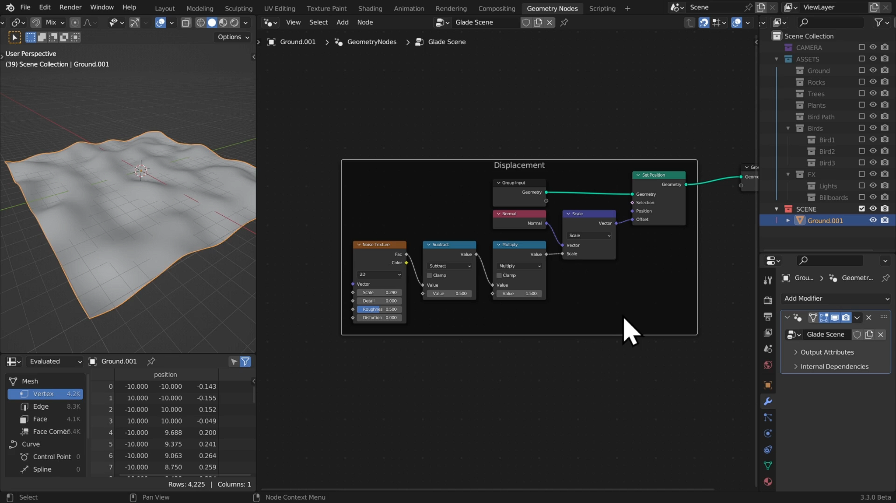

# DEV-08, Mesh Displacement
### Link:[<https://www.canopy.games/courses/bcs-geometry-nodes-3x/lectures/42544223>]
#### Tags: [Position, Noise Texture, Math (Subtract), Math (Multiply), Normal, Vector Math (Scale), SetPosition]

## Nothing new here except some minor optimizations from DEV-04

