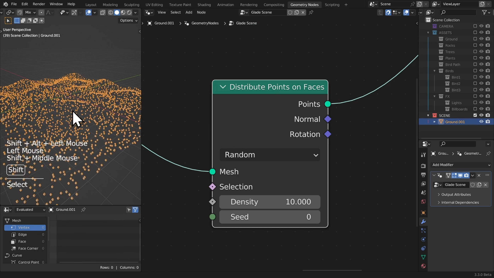
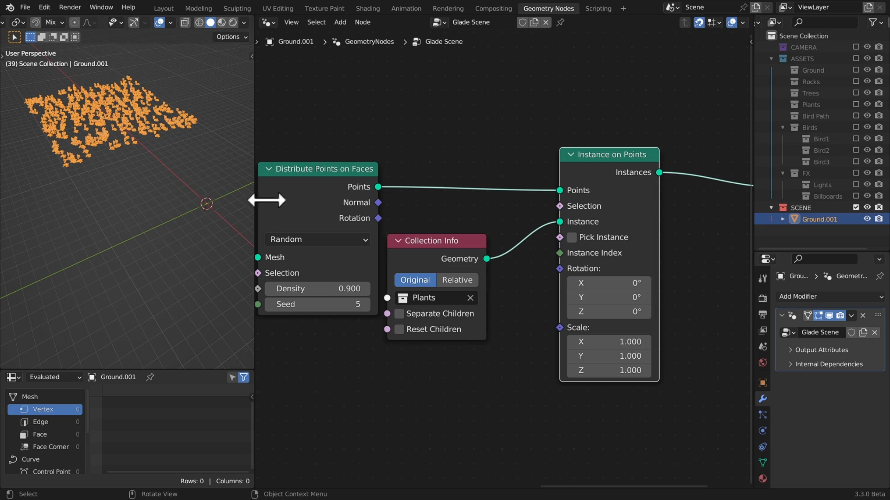
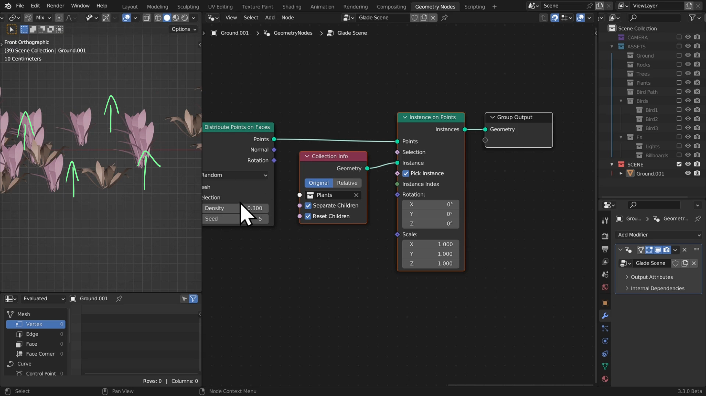
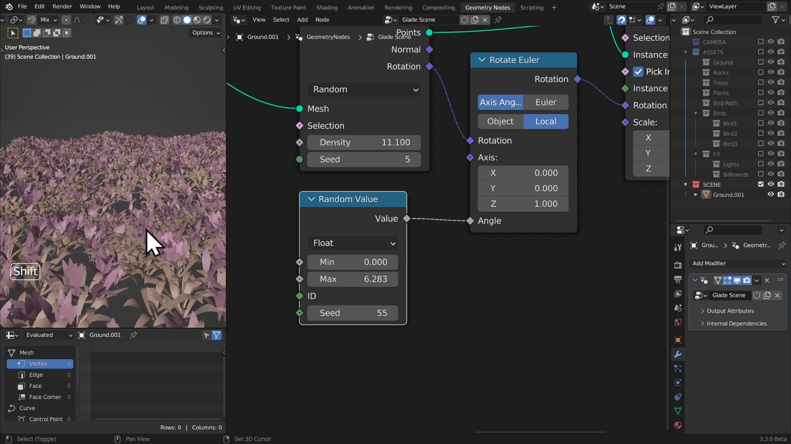

# DEV-09, Scattering a Collection 
### Link:[<https://www.canopy.games/courses/bcs-geometry-nodes-3x/lectures/42544238>]
#### Tags: []

## Scattering Points

### Distribute Points on Faces

### Collection info
    We get this node by dragging in our collection into the geometry node viewport

### Instance on Points

## Why are the instanced collection items off the origin?
    When we instanced our collection, we also took into consideration their location and that is something we need to disable.
    To do so we separate the children and reset the children to reset their position.

## Why are my collection items fused together?

    on the Instance on Points node, we need to select pick instances. This will make each point pick a different instance

## Why are my collection items rotation off?

## Why are my collection items scale off?

