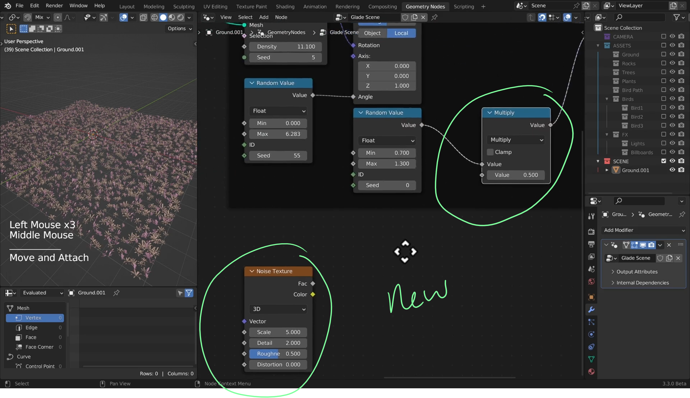
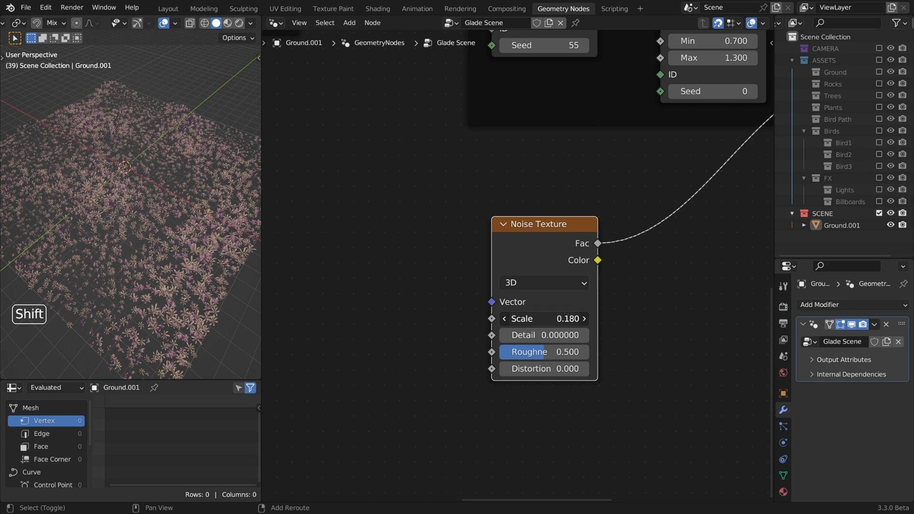
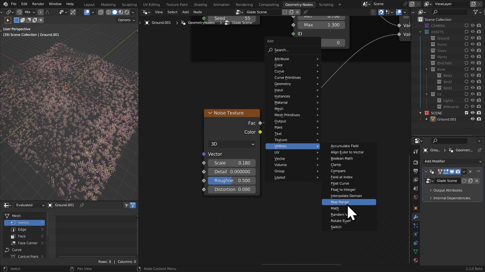
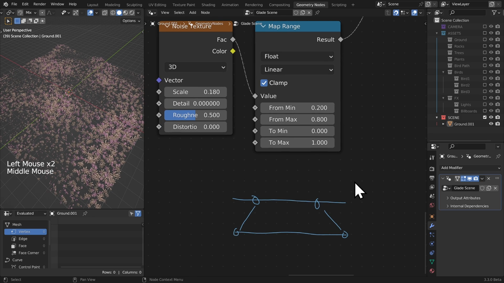
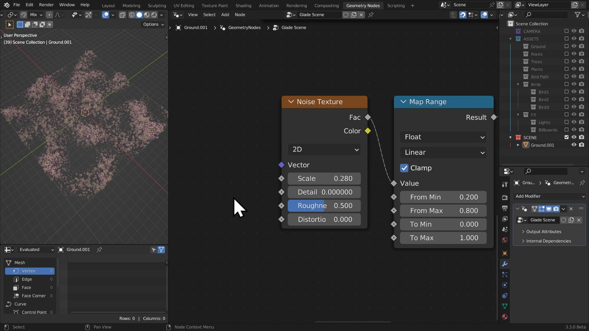
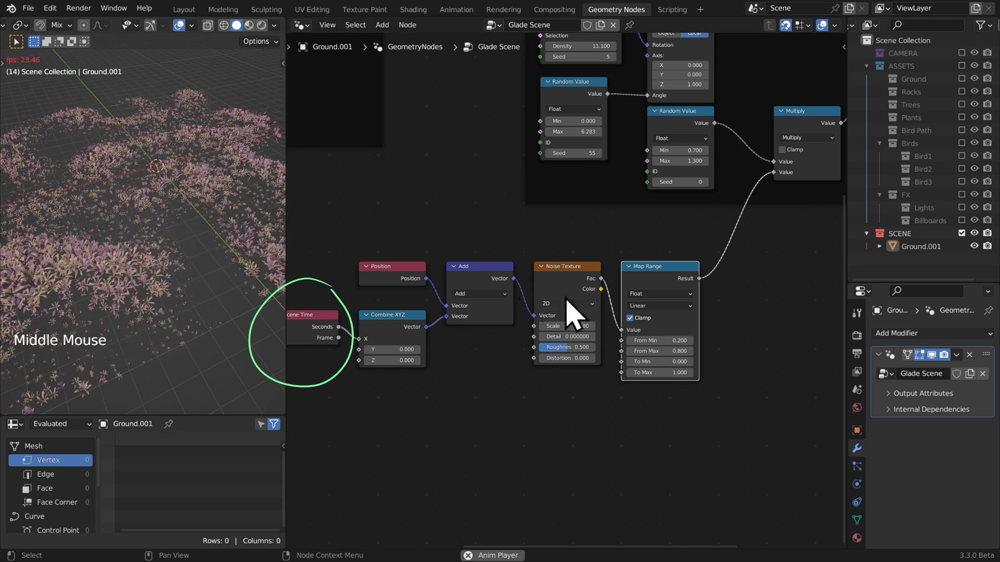

# DEV-10, Wind 1 Animated Noise
### Link:[<https://www.canopy.games/courses/bcs-geometry-nodes-3x/lectures/42544230>]
#### Tags: [Noise texture, MapRange, Scene Time]

## Add in the noise

## Remapping our range values using mapRange

## Animating using Scene Time node

